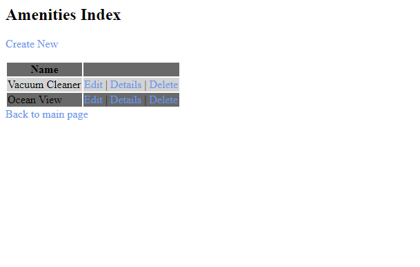

# Lab 13 - Async Inn
This is an Inn that uses MVC Core as well as Entity Framework.

## Visual
The main index page should look like the following:

One of the subsequent index pages should look like the following:

## How to use the program
Open the index page.
Click on any of the links to go to a site that will let you add/edit/delete/view details of the items.
You can choose to add items to each table or add items to the joins table.

## Author
Jimmy Nguyen